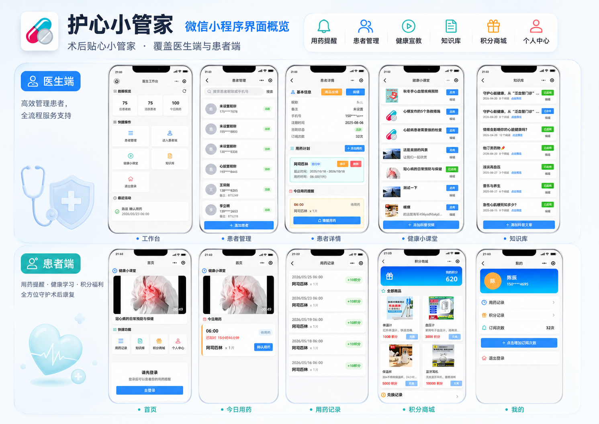

# Medication Help App

一个基于 uni-app 开发的微信小程序学习项目，围绕“患者按时用药提醒”这个真实场景，完整演示了 Vue3 页面开发、uniCloud 云函数、云数据库、微信登录/订阅消息、短信验证码、角色权限和积分兑换等常见小程序能力。

项目定位是 **uni-app + 微信小程序 + uniCloud 的入门与练手项目**。代码覆盖前端页面、API 封装、云函数、数据库 schema 和静态资源，适合用来学习一个小程序从页面到云端接口的完整闭环。



## 功能概览

- 患者端首页：展示健康小课堂、快捷入口、今日用药提醒、待确认/已用药/错过状态。
- 登录注册：支持手机号密码登录、短信验证码登录、注册补充资料、重置密码。
- 用药提醒：医护端为患者创建用药计划，按时间生成提醒记录，患者端确认用药。
- 用药积分：患者确认用药后获得积分，支持积分流水查询。
- 积分商城：展示商品列表，患者可使用积分兑换商品，医护端可查看和更新兑换状态。
- 健康内容：支持健康视频、健康文章、详情页、医护端内容创建/编辑/审核状态控制。
- 医护工作台：展示患者统计、今日用药概况、最近活动，提供患者管理入口。
- 患者管理：医护人员可添加患者、查看患者详情、维护患者用药计划、查看患者兑换记录。
- 订阅提醒：通过微信订阅消息向患者发送用药提醒，包含批量定时提醒和医护手动提醒入口。
- Token 管理：JWT 登录态保存到云数据库，支持撤销 token、清理过期 token。
- 云数据库 schema：包含用户、短信验证码、用药计划、提醒、日志、积分、商品、内容、微信 access_token 等集合定义。

## 技术栈

- uni-app / Vue3
- 微信小程序
- uniCloud 云函数与云数据库
- uview-plus 组件库
- jsonwebtoken
- dayjs

## 目录结构

```text
.
├── api/                         # 前端云函数 API 封装
├── docs/                        # 项目文档与截图
├── pages/                       # 小程序页面
│   ├── article/                 # 健康文章与详情
│   ├── index/                   # 患者端首页
│   ├── login/                   # 登录与重置密码
│   ├── mall/                    # 积分商城
│   ├── medical/                 # 医护工作台与内容管理
│   ├── medication/              # 用药计划新增/编辑
│   ├── patient/                 # 患者管理
│   ├── profile/                 # 个人中心、用药记录、积分记录
│   └── register/                # 注册资料补充
├── static/                      # 图片与 tabbar 资源
├── uniCloud-alipay/
│   ├── cloudfunctions/          # uniCloud 云函数
│   └── database/                # 云数据库 schema
├── uni_modules/                 # uni-app 插件模块
├── utils/                       # 本地存储、时间格式化等工具
├── App.vue
├── main.js
├── manifest.json
├── pages.json
└── package.json
```

## 快速开始

1. 克隆项目并安装依赖。

```bash
npm install
```

2. 使用 HBuilderX 打开项目。

3. 在 `manifest.json` 中配置自己的 uni-app 应用标识和微信小程序 AppID。

```json
{
  "appid": "__UNI__YOUR_APPID",
  "mp-weixin": {
    "appid": "wx-your-app-id"
  }
}
```

4. 关联或创建 uniCloud 服务空间，上传 `uniCloud-alipay/database` 下的数据库 schema。

5. 根据 `.env.example` 准备本地真实配置。

```bash
cp .env.example .env
```

Windows PowerShell 可以使用：

```powershell
Copy-Item .env.example .env
```

`.env.example` 只保存占位示例，适合提交到 GitHub；`.env` 保存你自己的真实 AppID、AppSecret、模板 ID 和 JWT 密钥，已经被 `.gitignore` 忽略，不要提交。

6. 配置云函数环境变量，并上传 `uniCloud-alipay/cloudfunctions` 下的云函数。

`.env.example` 中这一组是云函数使用的变量，需要在 uniCloud 云函数环境变量中配置同名值：

```text
JWT_SECRET=replace-with-a-random-secret
WECHAT_APP_ID=wx-your-app-id
WECHAT_APP_SECRET=replace-with-your-wechat-app-secret
WECHAT_SUBSCRIBE_TEMPLATE_ID=replace-with-your-subscribe-template-id
UNI_APP_ID=__UNI__YOUR_APPID
UNI_SMS_TEMPLATE_ID=replace-with-your-sms-template-id
```

变量说明：

- `JWT_SECRET`：JWT 签名密钥，用于登录 token 的生成与校验，生产环境请使用随机长字符串。
- `WECHAT_APP_ID`：微信小程序 AppID，用于获取 openid 和 access_token。
- `WECHAT_APP_SECRET`：微信小程序 AppSecret，只能放在云函数环境变量里，不要写入前端代码。
- `WECHAT_SUBSCRIBE_TEMPLATE_ID`：云函数发送微信订阅消息时使用的模板 ID。
- `UNI_APP_ID`：uni-app 应用标识，短信发送接口会用到。
- `UNI_SMS_TEMPLATE_ID`：uniCloud 短信模板 ID。

7. 配置前端订阅授权模板 ID。

`.env.example` 中的 `SUBSCRIBE_TEMPLATE_ID` 是前端项目使用的变量，对应 `pages/profile/profile.vue` 里的订阅授权模板 ID：

```text
SUBSCRIBE_TEMPLATE_ID=replace-with-your-subscribe-template-id
```

注意：微信小程序前端代码不能直接读取 uniCloud 云函数环境变量。当前项目里 `pages/profile/profile.vue` 使用常量：

```js
const SUBSCRIBE_TEMPLATE_ID = "your-subscribe-template-id";
```

本地运行时，把这里替换成 `.env` 中的真实 `SUBSCRIBE_TEMPLATE_ID`。开源提交时保持占位值即可。这个模板 ID 不是 AppSecret 级别的密钥，但仍建议不要在公开学习仓库里绑定到你的真实小程序配置。

8. 在 HBuilderX 中运行到微信开发者工具，按页面流程体验患者端和医护端功能。

## 角色说明

- `patient`：患者角色，可查看今日用药、确认用药、查看记录、兑换商品、订阅提醒。
- `medical`：医护角色，可进入医护工作台、管理患者、维护用药计划、管理健康内容、处理商品兑换。
- `admin`：管理员角色，拥有医护端权限，并可执行部分 token 管理类操作。

## 主要云函数

- `login` / `register` / `resetPassword` / `sendSmsCode`：账号登录、短信登录、注册与密码重置。
- `getTodayReminders` / `confirmMedication`：患者端今日提醒与确认用药。
- `addPatient` / `getPatientList` / `getPatientDetail` / `updatePatient`：患者管理。
- `addMedication` / `updateMedicationPlan` / `deleteMedicationPlan` / `getMedicationPlanDetail`：用药计划管理。
- `sendSubscriptionMessage` / `wechatUtils` / `refreshAccessToken`：微信订阅消息和 access_token 管理。
- `getUserPoints` / `addUserPoints` / `getPatientPointsLogs`：积分与流水。
- `getProducts` / `exchangeProduct` / `getExchangeHistory` / `updateExchangeStatus`：积分商城。
- `getHealthVideos` / `createVideo` / `updateVideo` / `deleteVideo`：健康视频管理。
- `getHealthArticles` / `createArticle` / `updateArticle` / `deleteArticle`：健康文章管理。

## 开源前安全检查

本仓库已经将真实的微信 `appSecret`、JWT secret、短信模板 ID、订阅消息模板 ID 改为环境变量或占位符。开源前仍建议检查下面几类内容：

- 不要提交真实的 `WECHAT_APP_SECRET`、`JWT_SECRET`、短信服务配置、数据库连接信息。
- `manifest.json` 中的微信 AppID 不是私钥，但会暴露小程序身份；公开学习项目建议替换为自己的占位值。
- `uniCloud-alipay/database/wechat_access_token.schema.json` 只是 schema，不应提交真实 access_token 数据导出。
- 不要提交本地 `.env`、HBuilderX 私有配置、微信开发者工具本地缓存和构建产物。
- 如果真实 `appSecret` 曾经进入过本地仓库历史，上传 GitHub 前请到微信公众平台重置该密钥。

## 学习建议

- 先从 `pages.json` 理解页面路由，再看 `api/index.js` 如何统一封装云函数调用。
- 对照 `pages/index/index.vue` 和 `getTodayReminders` / `confirmMedication` 学习患者端数据流。
- 对照 `pages/medical/index.vue`、`pages/patient/*` 和患者管理云函数学习医护端权限与业务流。
- 对照 `uniCloud-alipay/database/*.schema.json` 理解各集合之间的数据关系。
- 最后阅读 `uniCloud-alipay/cloudfunctions/common/auth/index.js`，理解 token 生成、验证、撤销和过期清理。

## License

MIT
